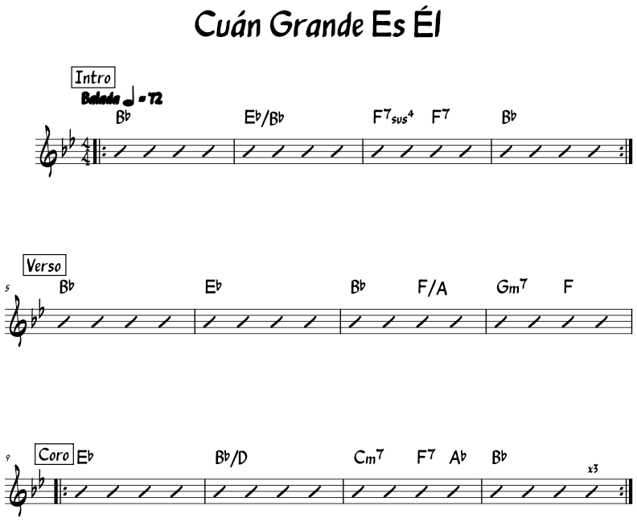
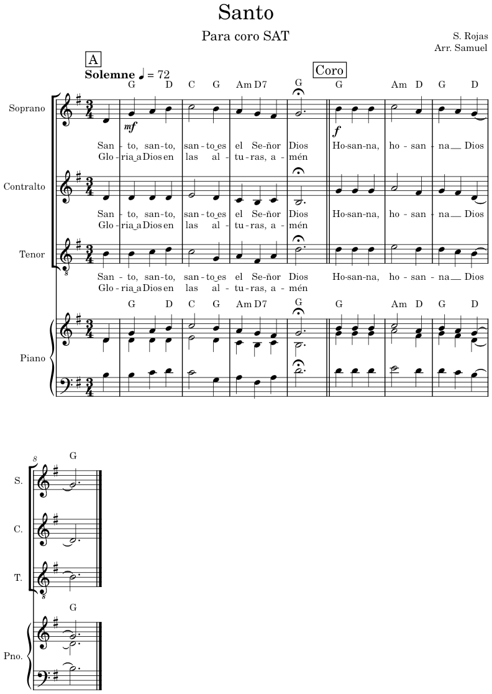
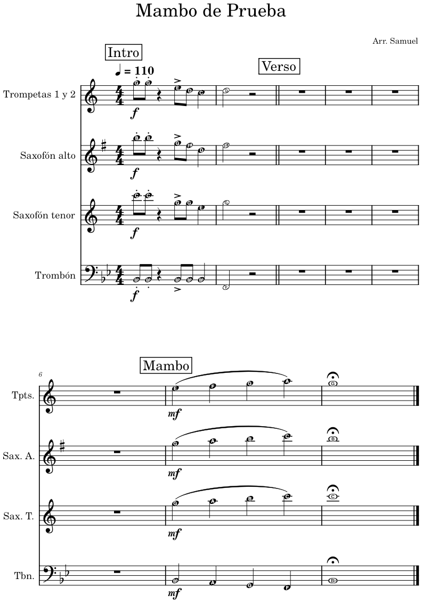

# MuseScore Dictation Skills

Skills para Claude que convierten música **dictada por voz** (o escrita a mano como texto) en partituras de **MuseScore 4**. Pensadas para músicos que arreglan para su banda, su coro o su sección de vientos y quieren pasar de la idea a la partitura sin ingresar nota por nota en MuseScore.

Todo funciona en dos pasos:

1. **Dictado → texto.** Hablas (o mandas una foto de lo que escribiste) y Claude lo convierte en un formato de texto compacto. Te lo muestra con una lista de *dudas* y espera tu confirmación.
2. **Texto → partitura.** Un script en Python genera el archivo `.mscz` (y PDF, y audios en el caso del coro). Tú solo pules detalles en MuseScore.

| Uso | Skill de dictado | Skill de partitura | Resultado |
|---|---|---|---|
| Cifrado para banda (slashes) | [`chart-dictation`](skills/chart-dictation) | [`slash-chart-musescore`](skills/slash-chart-musescore) | `.mscz` con barras rítmicas, acordes, secciones, repeticiones, estilo *Real Book* |
| Coro a 3 o 4 voces con letra | [`choir-dictation`](skills/choir-dictation) | [`choir-score-musescore`](skills/choir-score-musescore) | `.mscz` + PDF + reducción de piano + audios de ensayo por voz |
| Sección de vientos (trompetas, saxos, trombón) | [`brass-dictation`](skills/brass-dictation) | [`brass-score-musescore`](skills/brass-score-musescore) | `.mscz` + PDF transpuestos por instrumento, con el **nombre de la nota dentro de la cabeza** |

## Ejemplos

### Banda: cifrado con barras

```
Title: Cuán Grande Es Él
Tempo: 72 Balada
Key: Bb
[Intro]
|: Bb | Eb/Bb | F7sus4 F7 | Bb :|
[Verso]
| Bb | Eb | Bb F/A | Gm7 . F . ||
[Coro]
|: Eb | Bb/D | Cm7 . F7 Ab | Bb :|x3
```



### Coro SAT con letra

```
Title: Santo
Voices: S A T
Key: G
Time: 3/4
Tempo: 72 Solemne

[A]
S: D4:4 | mf G A B | C:2 B:4 | A G F# | G:2.^ ||
A: D4:4 | D D D | E:2 D:4 | C B C | B:2.^ ||
T: B3:4 | B C D | C:2 G:4 | A F# A | D':2.^ ||
Chords: | G . D | C . G | Am D7 . | G |
Lyrics: San-to, san-to, san-to~es el Se-ñor Dios
```



Audios de ensayo del ejemplo: [todas las voces](ejemplos/coro/santo-todos.mp3) · [soprano destacada](ejemplos/coro/santo-soprano.mp3)

### Vientos con nombres de notas

Se escribe en **sonido real** (como en el piano); cada instrumento sale transpuesto a su tonalidad escrita, con el nombre de la nota que lee dentro de la cabeza.

```
Title: Mambo de Prueba
Key: Bb
Tempo: 110

[Intro]
TP: f F5:8! F! R:4 D:8> C Bb:4 | C:2 R:2 ||
AS: f D5:8! D! R:4 Bb:8> A F:4 | A:2 R:2 ||
TS: f Bb4:8! Bb! R:4 F:8> F D:4 | F:2 R:2 ||
TB: f Bb2:8! Bb! R:4 Bb:8> Bb Bb:4 | F:2 R:2 ||
```



Todos los archivos de ejemplo (`.txt` de entrada, `.mscz`, `.pdf`, `.mp3`) están en [`ejemplos/`](ejemplos).

## Requisitos

- **Claude con skills y ejecución de código** (Claude en la web o en la app de escritorio, Cowork, o Claude Code).
- **Python 3** (solo biblioteca estándar).
- **MuseScore 4** para el coro y los vientos (el cifrado de banda no lo necesita). Si Claude trabaja en un entorno Linux sin MuseScore, las skills explican cómo descargarlo automáticamente. En tu computador, instala MuseScore 4 desde [musescore.org](https://musescore.org).

## Instalación

Cada carpeta dentro de [`skills/`](skills) es una skill completa (`SKILL.md` + script). Instala las seis, o solo el par que necesites (la skill de dictado usa el script de su skill de partitura).

**Claude (web, escritorio, Cowork)**

1. Descarga los `.zip` que necesites desde [`dist/`](dist) (uno por skill, listos para subir).
2. En Claude, ve a la sección **Skills** de la configuración y sube cada `.zip`.

Si modificas una skill, vuelve a comprimir su carpeta de `skills/` (la carpeta completa dentro del `.zip`).

**Claude Code**

```bash
git clone https://github.com/samuelrojasp/musescore-dictation-skills.git
cp -r musescore-dictation-skills/skills/* ~/.claude/skills/
```

## Cómo se usa

Pídele a Claude cosas como:

- *"Arma el cifrado: Title: … | G | D/F# | Em C |"* → `slash-chart-musescore`
- *"Te dicto una canción para la banda: título…, intro cuatro compases de re…"* → `chart-dictation`
- *"Te dicto un arreglo para coro SAT: soprano, compás uno: re negra…"* → `choir-dictation`
- *"Te mando la foto de las notas de los vientos"* → `brass-dictation`

Claude te mostrará el texto convertido y las dudas; corriges por voz o texto ("el compás seis es mi menor") y cuando dices *"dale"* genera la partitura.

## Formato de texto (resumen)

| Elemento | Sintaxis |
|---|---|
| Compases | `\|`, doble barra `\|\|`, repetición `\|:` … `:\|`, `:\|x3` |
| Secciones | `[Intro]`, `[Coro]`… (marca de ensayo) |
| Notas (coro/vientos) | `G`, `F#`, `Bb`, `En` (becuadro); octava opcional `C4` (do central) |
| Octava relativa | sin número va a la nota más cercana; `'` arriba, `,` abajo |
| Duración | `:1` redonda, `:2` blanca, `:4` negra, `:8` corchea, `:16`; puntillo `:4.`; se mantiene hasta que cambia |
| Silencios | `R`, `R:2`; `R*8` = 8 compases (vientos) |
| Ligadura / calderón / legato | `~` / `^` / `(` … `)` |
| Acento / staccato (vientos) | `>` / `!` |
| Dinámicas | `pp p mp mf f ff` antes de la nota |
| Letra (coro) | `Lyrics:` división silábica automática en español; `_` melisma; `~` sinalefa |
| Acordes | `Chords: \| G . D \| Am D7 . \|` (`.` = tiempo sin cambio) |

El detalle completo está en el README de cada skill.

## Limitaciones actuales

- Sin tresillos, reguladores (crescendo/decrescendo), glissandos ni caídas.
- Sin cambios de compás o tonalidad a mitad de la pieza.
- Sin casillas de 1ª y 2ª vez.
- El dictado depende de la calidad del reconocimiento de voz: por eso siempre se muestra el texto antes de generar la partitura, y el script avisa de compases que no suman, sílabas que sobran y notas fuera de registro.

Lo que no está soportado aparece en la lista de dudas para que lo agregues a mano en MuseScore.

## Licencia

[MIT](LICENSE). Creado por Samuel Rojas con Claude.
